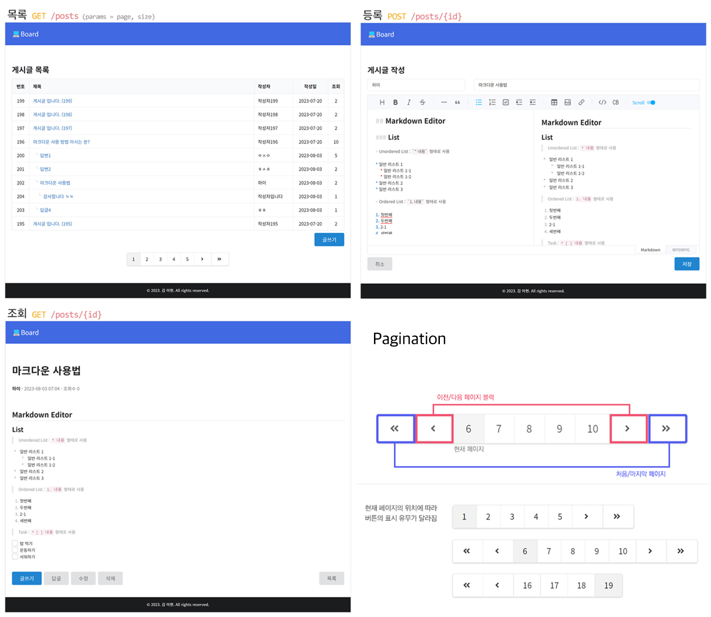

# spring-thymeleaf-board

## 🛠️ 사용 기술

- Java
- Spring Boot
- Gradle
- Mybatis
- MariaDB
- Thymeleaf


#### Tools
- intellij IDEA

#### Gradle dependencies
``` gradle
dependencies {
    implementation 'org.springframework.boot:spring-boot-devtools'
    implementation 'org.springframework.boot:spring-boot-starter-aop'
    implementation 'org.springframework.boot:spring-boot-starter-web'
    implementation 'org.springframework.boot:spring-boot-starter-jdbc'
    implementation 'org.springframework.boot:spring-boot-starter-validation'
    implementation 'org.springframework.boot:spring-boot-starter-thymeleaf'
    implementation 'org.mybatis.spring.boot:mybatis-spring-boot-starter:2.2.2'
    implementation 'nz.net.ultraq.thymeleaf:thymeleaf-layout-dialect'
    runtimeOnly 'org.mariadb.jdbc:mariadb-java-client'
    compileOnly 'org.projectlombok:lombok'
    annotationProcessor 'org.projectlombok:lombok'
    testCompileOnly 'org.projectlombok:lombok'
    testAnnotationProcessor 'org.projectlombok:lombok'
    testImplementation 'org.springframework.boot:spring-boot-starter-test'
    testImplementation 'org.mybatis.spring.boot:mybatis-spring-boot-starter-test:2.2.2'
}
```
* Logback: `src/main/resources/logback-spring.xml` 
* lombok: `@Getter`, `@Setter`, `@NoArgsConstructor`, `@RequiredArgsConstructor`, `@AllArgsConstructor` 등
* thymeleaf, thymeleaf-layout

#### Libs

- [Semantic UI](https://semantic-ui.com/)
- [Toast UI Editor](https://ui.toast.com/tui-editor)
- [toastr](https://github.com/CodeSeven/toastr)

<br>

## 👩🏻‍💻 기능

### Pagination
- 페이지를 탐색할 수 있는 `페이지네이션`을 포함
  - 처음, 이전, 번호, 다음, 마지막
  - 현재 페이지의 범위는 `1`이상, `전체 페이지`미만
  - 만약, 범위 내의 값이 넘어오는 경우 첫 페이지로 리다이렉트

### Post

#### 게시글 목록 (`/posts`)

 ```
| No | 제목
|----|----------------------
| 9  | ᄂ게시글8의 답글 입니다.
| 3  | 게시글3 입니다.
| 2  | 게시글2 입니다.
| 1  | 게시글1 입니다.
| 4  |  ᄂ 게시글1의 답글 입니다.
| 6  |   ᄂ 게시글4의 답글 입니다.
| 5  |  ᄂ 게시글1의 답글 입니다.
|----|----------------------
```

- 제한 없이 확장이 가능한 계층형 게시판


#### 게시글 조회 (`/posts/{id}`)

- URL 조작해 삭제된 게시글을 조회하려고 할 때, `alert`로 안내 후 `redirect`
- 게시글을 조회할 때 조회수 증가

#### 게시글  등록 (`/posts/add`)

- 닉네임(20자), 제목(100자), 내용
- 모든 내용은 필수 값이며, 검증 후 메시지(`toastr`) 창에 오류 메시지를 띄움
- 내용은 `Toast UI Editor`을 연동해 `markdown`형태로 작성 가능

#### 게시글 답글 (`/posts/{parentId}/reply`)

- 게시글 등록과 동일한 구조 (단, 상위게시글의 아이디 값을 넘겨받음)

#### 게시글 수정 (`/posts/{id}/edit`)

- 게시글 수정 시에는 닉네임 수정 불가

#### 게시글 삭제 (`/posts/{id}/remove`)

- 게시글 삭제 유무를 `confirm`으로 확인
- 실제 데이터를 삭제하지 않고 `status`값의 갱신을 통해 삭제 처리

### Log

- `logback` 을 사용하여 일 단위로 로그를 파일로 저장
- `aop`로 컨트롤러의 요청이나 서비스 단의 처리내용을 로그로 남김


## Preview

